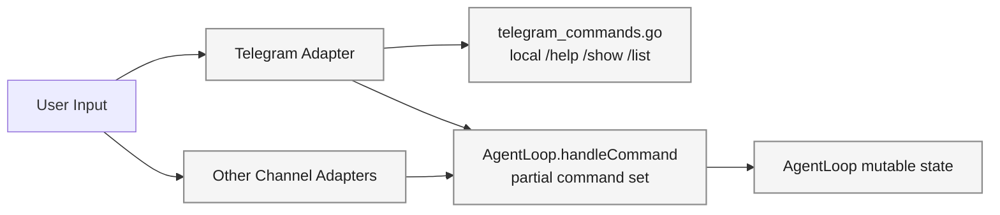
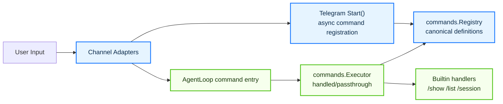
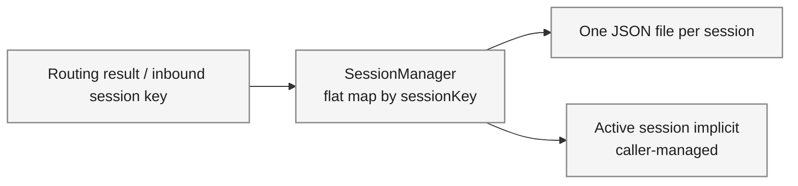
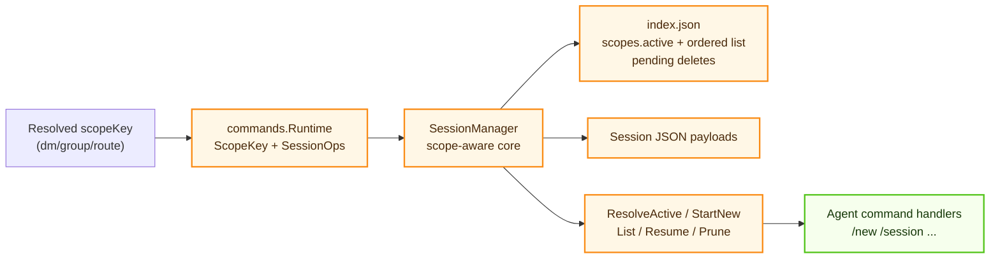

# Session Management + Command Stack Architecture Change (#959/#960/#961)

## Scope

This document separates architecture changes into two concerns:

- Commands path: channel adapters, agent command entry, and command package execution model.
- Session path: scope-aware indexing, active-pointer lifecycle, and persistence model.

## 1) Commands Architecture Change

### Before (upstream main)

### After (stacked PRs)

### Command Impact

- Command definitions are globally visible and shared by all channels.
- Channel-specific support filtering is removed from `pkg/commands`; execution is now command-name driven.
- `/show channel` and `/list channels` remain user-visible features handled by builtin handlers.
- Telegram command menu sync still exists, but it now consumes the same canonical definitions.

## 2) Session Architecture Change

### Before (upstream main)

### After (stacked PRs)

### Session Impact

- Session lifecycle is explicitly scope-aware instead of relying on a flat key convention.
- Active session pointer and ordered history are persisted in index metadata, enabling deterministic `list/resume` behavior.
- New-session rotation and prune are first-class operations with rollback/deferred-delete safeguards.
- Agent command runtime now consumes session operations through a narrow interface, reducing coupling.

## PR Layer Mapping

- #959: shared command registry model, channel integration points, and Telegram async registration baseline.
- #960: scope-aware `SessionManager`, persistent scope index, and lifecycle operations.
- #961: centralized command execution via runtime-backed executor and agent integration.
